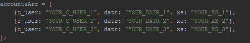

# Agario XPBOT (a.k.a Facebots)

-------------------------

**Facebots** are bots that login with your facebook account and gain mass (a.k.a XP) yor you.

[Tutorial video (Coming Soon!)] (https://youtube.com) 

# Installation

**Windows**     
----------------------

* **1.** Install NodeJs [(32 bit)] (https://nodejs.org/dist/v5.6.0/node-v5.6.0-x86.msi)  [(64 bit)] (https://nodejs.org/dist/v5.6.0/node-v5.6.0-x64.msi)
* **2.** Download this repo [Download ZIP] (https://github.com/camilleeyries/AGAR-XPBOT/archive/master.zip)
* **3.** Extract to any folder... ex. C:\Agar-Xp-Bots
* **4.** Open "Install Dependencies (Windows).bat" and follow the instructions
* **5.** Install this extension: ([Chrome] (https://chrome.google.com/webstore/detail/editthiscookie/fngmhnnpilhplaeedifhccceomclgfbg), [Firefox] (https://addons.mozilla.org/en-US/firefox/addon/cookie-manager-button/))
* **6.** Go to [Facebook] (**Facebook.com**) and login with your account
* **7.** Get ``c_user, datr and xs cookies`` using the extension you installed
  * Now copy each of them and paste them in the  right position in  "Facebots.js" in "src" folder
  * 
* **8.** Copy proxy.sample.txt to proxy.txt and paste you proxies under correct section... (Update them everyday... you can get them on Google for free)
  * You need to use proxies to connect multiple bots, the usual max limit for one IP is **3** clients/bots
* **9.** Open "Start (Windows).bat"
* **10.** Launch Chrome/Firefox and go to Agar.io to see your xp raising. Enjoy :)

If you don't understand these "simple" instructions open an issue...

-------------

**Other OS**        
----------------------

**Coming soon!**

----------------------

# Tuning
- You can modify many options in the Facebots.js file

# TODO
- Set a timeout to connect bot to avoid the "connection lost !!" error ALREADY DO !
- Make a stat board with mass average using ansi escapes codes.

# Issues
- Make sure you have the latest version of agario-client
- Verify your facebooks account information (I will make a video tutorial later)
- If you can't fix your issue yourself, then open an issue and (please add tags, I LOVE TAGS!)

# Screenshots

# Contributors
#### Author: [Camille Eyriès - ME(arfarf)](https://github.com/camilleeyries)

#### Contributors: [hassanila97](https://github.com/hassanila97), [Petterholm](https://github.com/petterholm), [pulviscriptor](https://github.com/pulviscriptor)

**You can modify this code for personal use, but you can't claim it as yours, you need to refer to [**this repo**] (http://github.com/camilleeyries/AGAR-XPBOT) in your README.md**

